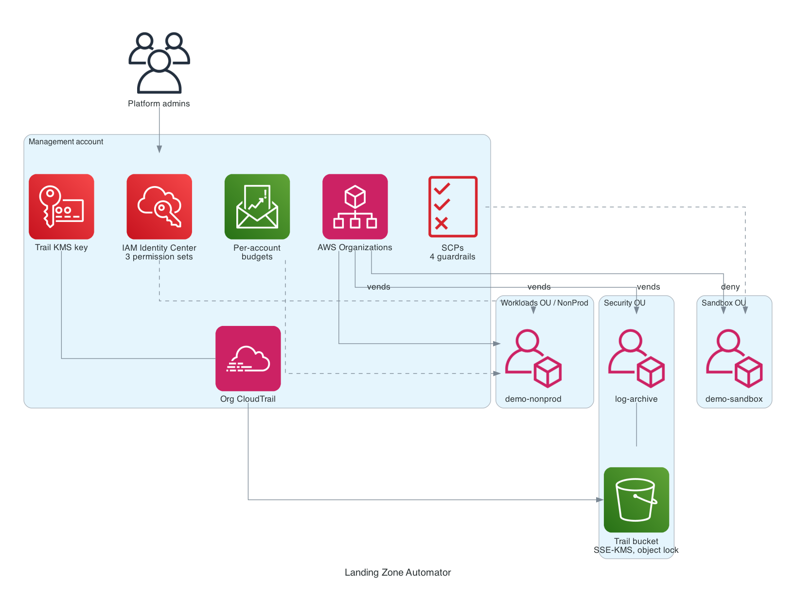

# Landing Zone Automator

A Terraform account vending machine for AWS. One apply stands up a SOC 2 ready multi-account foundation (organizational units, service control policies, SSO, centralized audit logging, budget alarms). After that, every new account is one block in a tfvars file and it arrives with guardrails, logging, tags, a budget, and SSO access already applied.

Built for the gap between "one shared account with a root login" and "we need Control Tower and a platform team":

- **Startups getting SOC 2 ready.** Account separation, immutable centralized audit logs, SSO with least privilege, root account controls. One apply covers the four things auditors ask about first.
- **SaaS teams vending environments.** Dev, staging, and prod accounts per product from a request block. The small-scale version of the account vending pattern platform teams run internally.
- **MSPs onboarding clients.** New client, day one: an account lands inside guardrails with logging, budgets, and access wired. A recurring workflow, not a one-time script.



See [ARCHITECTURE.md](ARCHITECTURE.md) for the full design, cost model, and teardown risk notes.

## What gets built

| Layer | Resources |
|---|---|
| Organization | AWS Organizations (all features), OUs: Security, Workloads/Prod, Workloads/NonProd, Sandbox |
| Guardrails | SCPs: deny root user, deny leaving the org, region allowlist, CloudTrail tamper protection |
| Identity | IAM Identity Center groups (PlatformAdmins, Developers, ReadOnly), permission sets, per-account assignments |
| Logging | Organization CloudTrail, SSE-KMS, into a versioned object-locked bucket in a dedicated log-archive account |
| Vending | `account_requests` map creates accounts in the right OU with tags, a monthly budget alarm at 80%, and an in-account baseline (IAM alias, strict password policy, smoke-test role, default VPC removed) |

Rough cost for a full deploy-demo-destroy cycle: **under $0.50**. Organizations, SCPs, Identity Center, and Budgets are free; the only line items are the trail's KMS key (prorated ~$0.03/day) and pennies of S3.

## Sensitive values never reach the repo

- All real variable files (`*.tfvars`) and the backend config (`backend.hcl`) are gitignored; only `*.example` placeholders are committed.
- Account emails, the notification email, and account IDs exist only in the gitignored tfvars and in remote state. Outputs that carry account IDs are marked `sensitive`.
- Remote state lives in an encrypted S3 bucket, initialized via `-backend-config=backend.hcl` so the bucket name stays out of git too.
- CI authenticates with GitHub OIDC, no static keys, and plans only against the committed example file.

## Prerequisites

1. A fresh AWS account to act as the management account, with admin credentials configured locally.
2. **Enable IAM Identity Center once in the console** (management account, home region). Terraform manages everything inside it but cannot create the instance.
3. An S3 bucket for remote state.
4. Terraform >= 1.6, AWS CLI v2, Python 3 (for the diagram and the VPC script).

## Deploy

```bash
cp backend.hcl.example backend.hcl        # fill in your state bucket
cp envs/demo.tfvars.example envs/demo.tfvars   # fill in real emails, dated account names

terraform init -backend-config=backend.hcl

# Stage 1: org, OUs, SCPs, accounts, Identity Center, budgets
terraform apply -var-file=envs/demo.tfvars

# Stage 2: capture the new account IDs for the cross-account providers,
# flip phase2_enabled = true in envs/demo.tfvars, then apply again
./scripts/write-phase2-tfvars.sh
terraform apply -var-file=envs/demo.tfvars
```

Two stages because Terraform provider configurations are static and must resolve at plan time: the aliased providers that assume roles into the log-archive and vended accounts need account IDs that do not exist until stage 1 finishes. The helper script copies those IDs from the stage 1 outputs into a gitignored `phase2.auto.tfvars`. This is a real-world Terraform constraint worth knowing, not a workaround for a bug.

Then remove each vended account's default VPC:

```bash
ACCOUNT_ID=$(terraform output -json vended_account_ids | python3 -c 'import json,sys; print(list(json.load(sys.stdin).values())[0])')
./scripts/delete-default-vpc.sh "$ACCOUNT_ID"
```

If an Organization already exists in the management account, import it first:

```bash
terraform import module.organization.aws_organizations_organization.this <org-id>
```

## Validate (the demo)

1. **Account landed in the right OU with tags:**
   `aws organizations list-accounts-for-parent --parent-id <nonprod-ou-id>`
2. **SCP region denial:** assume the smoke-test role in a vended account, then call a denied region and watch the explicit deny:
   `aws ec2 describe-instances --region eu-west-1` → `AccessDenied ... with an explicit deny in a service control policy`
3. **SSO access:** log in at the `sso_portal_url` output as a Developers member; confirm access to the nonprod account and no tile for the management account.
4. **CloudTrail delivery:** within ~15 minutes, objects appear under `AWSLogs/<org-id>/<vended-account-id>/` in the log-archive bucket.
5. **Budget wired:** `aws budgets describe-budgets --account-id <management-account-id>` shows the per-account caps with the email subscriber.
6. **Default VPC gone:** via the smoke-test role, `aws ec2 describe-vpcs` in the vended account returns an empty list.

## Destroy

```bash
terraform destroy -var-file=envs/demo.tfvars
```

`close_on_deletion = true` means destroy closes the vended accounts rather than orphaning them. Then the manual tail, in order:

1. **Closed accounts linger.** AWS suspends closed accounts for 90 days before purging; they stay visible in the org but bill nothing. Their emails cannot be reused during that window, hence the date-suffixed names.
2. **Object-locked log objects.** Retention is governance mode at 1 day; if destroying same-day, the bucket's `force_destroy` handles current versions and locked versions clear after a day. Re-run destroy the next day if S3 refuses.
3. **Identity Center instance** stays enabled (console-only to disable; costs nothing).
4. **Delete the Organization** last, from the console or `aws organizations delete-organization`, once all member accounts are closed.
5. Sweep for leftovers: `aws organizations list-accounts`, `aws cloudtrail list-trails`, the state bucket entry.

## Repo layout

```
├── main.tf / providers.tf / variables.tf / outputs.tf / versions.tf
├── modules/
│   ├── organization/        org, OUs, SCPs, log-archive account
│   ├── account-vending/     member accounts + per-account budgets
│   ├── identity-center/     groups, permission sets, assignments
│   ├── log-archive/         KMS, locked S3 bucket, organization trail
│   └── account-baseline/    in-account IAM baseline via assumed role
├── envs/demo.tfvars.example
├── scripts/delete-default-vpc.sh
├── .github/workflows/ci.yml fmt, validate, tflint, checkov, gitleaks, OIDC plan
└── diagram.py
```

## Known constraints

- Account closure is rate limited (10% of member accounts per rolling 30 days, minimum 10).
- The baseline uses statically aliased providers, so the demo baselines at most 2 vended accounts. Scaling past that means generated provider configs or a wrapper (Terragrunt, stacks), which is exactly the conversation this project is designed to start.
- The Azure flavor (subscription vending under management groups, reusing the existing Azure Landing Zone patterns) is a planned phase 2 in a separate repo.
